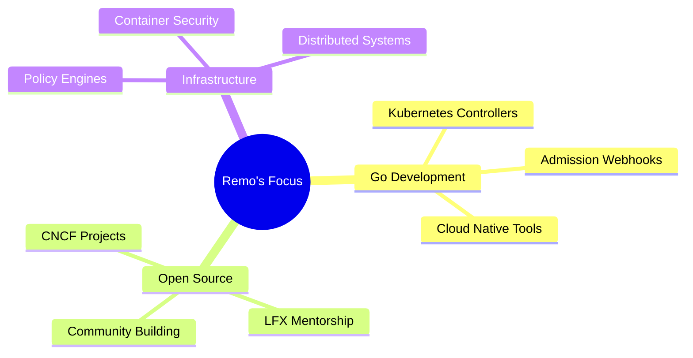

<div align="center">

  <!-- Animated Wave -->
  

  <br/>

  <!-- Dynamic Typing -->
  <a href="https://git.io/typing-svg">
    
  </a>

  <br/>

  <!-- Animated Badges -->
  <p>
    <a href="https://github.com/remo-lab">
      
    </a>
    <a href="https://github.com/remo-lab?tab=repositories">
      
    </a>
    <a href="https://github.com/search?q=is%3Apr+author%3Aremo-lab&type=pullrequests">
      
    </a>
  </p>

  <!-- Profile Views Counter -->
  
  <a href="https://github.com/remo-lab?tab=followers">
    
  </a>

</div>

<br/>


##  **About Me**

```go
package main

import "fmt"

type CloudNativeEngineer struct {
    Name       string
    Role       string
    Languages  []string
    Focus      []string
    Goals      []string
    FunFact    string
}

func main() {
    remo := CloudNativeEngineer{
        Name:      "Remo Panda",
        Role:      "Cloud Native Engineer & Open Source Contributor",
        Languages: []string{"Go", "Python", "Bash", "YAML"},
        Focus: []string{
            "Kubernetes Controllers & Operators",
            "Admission Webhooks & Policy Engines",
            "Cloud Native Infrastructure",
            "Distributed Systems",
        },
        Goals: []string{
            "LFX Mentorship",
            "CNCF Long-term Contributor",
            "Building impactful OSS tools",
        },
        FunFact: "I don't just learn tools — I contribute to the systems that build them.",
    }

    fmt.Printf("👋 Hey, I'm %s!\n", remo.Name)
}
```

<div align="center">
  
</div>

<br/>


##  **Tech Arsenal**

<div align="center">

  ### 🐹 Primary Stack

  <a href="https://go.dev/">
    
  </a>
  <a href="https://kubernetes.io/">
    
  </a>
  <a href="https://www.docker.com/">
    
  </a>

  <br/><br/>

  ### 💻 Languages & Tools

  
  <br/>
  

  <br/><br/>

  ### 🔧 Specialized In

  <table>
    <tr>
      <td align="center" width="150">
        
        <br><b>Go</b>
        <br><sub>Controllers & Webhooks</sub>
      </td>
      <td align="center" width="150">
        
        <br><b>Kubernetes</b>
        <br><sub>Admission Control</sub>
      </td>
      <td align="center" width="150">
        
        <br><b>Docker</b>
        <br><sub>Containerization</sub>
      </td>
      <td align="center" width="150">
        
        <br><b>Prometheus</b>
        <br><sub>Monitoring</sub>
      </td>
    </tr>
  </table>

</div>

<br/>


##  **Open Source Journey**

<div align="center">

  > _Contributing to the backbone of cloud infrastructure_

  <br/>

  |  |  |  |  |
  |:---:|:---:|:---:|:---:|
  | Policy Engine | Blockchain Infra | Container Registry | Test Generation |
  | Admission Control | Permissioned DLT | Cloud Native | Observability |
  | Validation Webhooks | Enterprise Blockchain | Registry Security | API Testing |

  <br/>

  <a href="https://github.com/search?q=is%3Apr+author%3Aremo-lab&type=pullrequests">
    
  </a>

  <a href="https://github.com/search?q=is%3Aissue+author%3Aremo-lab&type=issues">
    
  </a>

</div>

<br/>


##  **GitHub Analytics**

<div align="center">

  <a href="https://github.com/remo-lab">
    
    
  </a>

  <br/><br/>

  

  <br/><br/>

  

</div>

<br/>


## 🏆 **Achievements**

<div align="center">
  
</div>

<br/>


## 🎯 **Current Focus**

<div align="center">



</div>

<table align="center">
  <tr>
    <td>🐹 Writing <b>Go code</b> for K8s controllers & webhooks</td>
    <td>📚 Deep-diving into <b>CNCF project internals</b></td>
  </tr>
  <tr>
    <td>🔧 Building <b>admission control systems</b></td>
    <td>🚀 Preparing for <b>LFX Mentorship</b></td>
  </tr>
  <tr>
    <td>🧪 Improving <b>testing & CI/CD pipelines</b></td>
    <td>🤝 Collaborating with <b>maintainers & mentors</b></td>
  </tr>
</table>

<br/>


## 🤝 **Let's Connect**

<div align="center">

  <a href="https://github.com/remo-lab">
    
  </a>
  <a href="https://linkedin.com/">
    
  </a>
  <a href="mailto:your-email@example.com">
    
  </a>

  <br/><br/>

  

</div>

<br/>


<div align="center">
  
</div>
